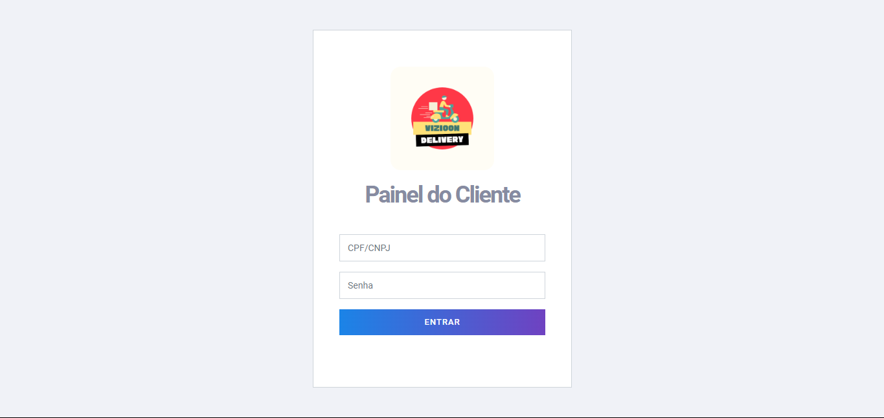
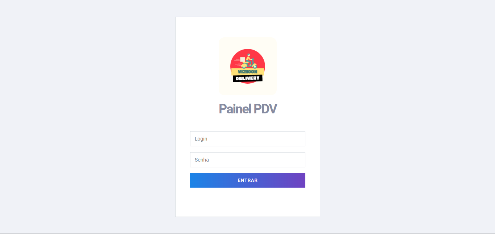
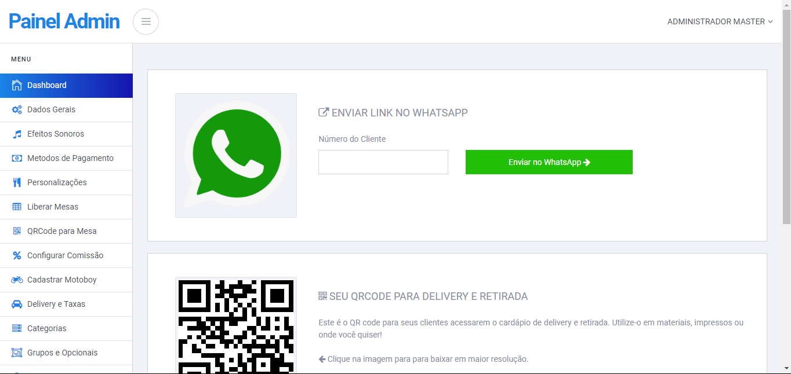
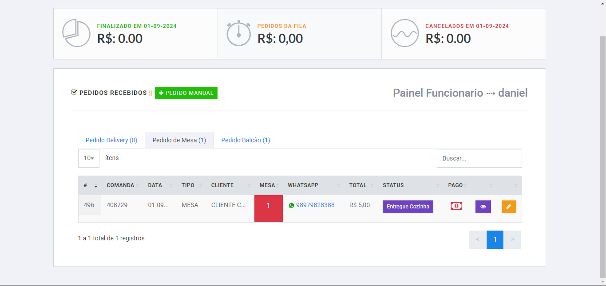
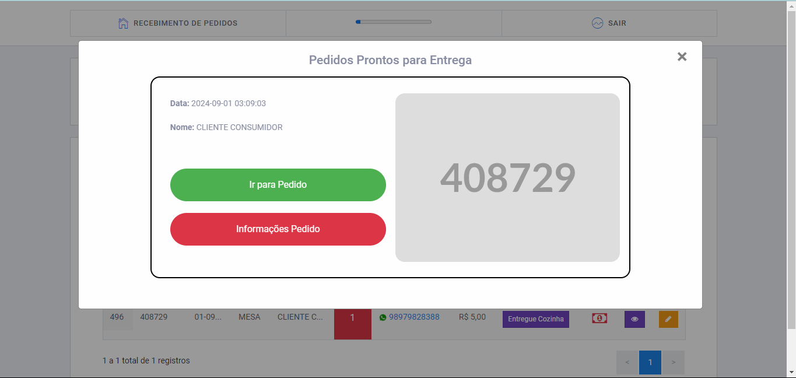
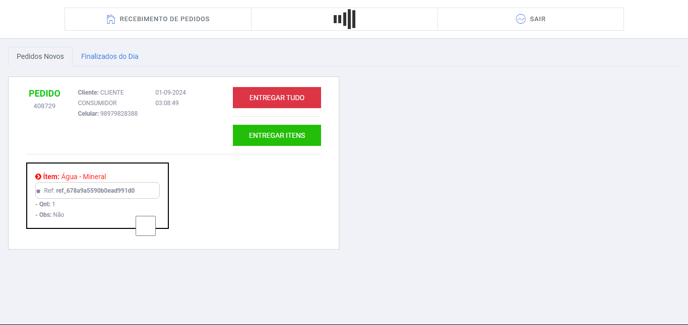

# 📱 Vizioon Delivery

<p align="center">
  
</p>

<p align="center">
  <a href="https://github.com/dvizioon/VIZIOON-DELIVERY/issues">
    
  </a>
  <a href="https://github.com/dvizioon/VIZIOON-DELIVERY/fork">
    
  </a>
  <a href="https://github.com/dvizioon/VIZIOON-DELIVERY/stargazers">
    
  </a>
  <a href="https://github.com/dvizioon/VIZIOON-DELIVERY/license">
    
  </a>
</p>

## 💼 Quero Comprar o Sistema

Se você deseja adquirir o sistema **Vizioon Delivery** e modernizar o fluxo de pedidos do seu estabelecimento, entre em contato conosco! Oferecemos uma solução completa que vai desde a integração com WhatsApp até o gerenciamento de produtos em tempo real, tudo pensado para otimizar suas vendas.

📞 **Telefone:** [(98) 97014-9904](tel:+5598970149904)

✉️ **Email:** [danielestevao.sistemas@gmail.com]()


## 📋 Índice

- [Sobre o Projeto](#sobre-o-projeto)
- [Funcionalidades](#funcionalidades)
- [Demonstração](#demonstração)
- [Tecnologias Utilizadas](#tecnologias-utilizadas)
- [Pré-requisitos](#pré-requisitos)
- [Instalação](#instalação)
---

## 📖 Sobre o Projeto

O **Cardápio Digital Integrado com WhatsApp** é uma solução completa e eficiente para estabelecimentos do ramo alimentício que desejam modernizar e agilizar o processo de pedidos. Com uma interface intuitiva e amigável, permite que os clientes realizem pedidos diretamente pelo WhatsApp, proporcionando praticidade e aumentando o potencial de vendas.

Este projeto visa reduzir a complexidade na gestão de pedidos, eliminando a necessidade de aplicativos intermediários e taxas adicionais. É uma ferramenta ideal para restaurantes, lanchonetes, cafeterias e outros estabelecimentos que buscam uma presença digital forte e eficaz.

---

## 🚀 Funcionalidades Principais

- **Integração com WhatsApp**: Receba pedidos diretamente no WhatsApp, permitindo que o cliente finalize a compra através de uma conversa.
- **Gerenciamento de Produtos em Tempo Real**: Adicione, remova ou edite produtos e preços diretamente no painel administrativo.
- **Relatórios Detalhados**: Acompanhe o histórico de vendas e gere relatórios customizados com filtros de datas.
- **Pedidos em Tempo Real**: Atualização instantânea dos pedidos no painel de controle, facilitando o acompanhamento dos pedidos abertos.
- **Compartilhamento de Link e QR Code**: Facilite o acesso ao cardápio digital com links ou QR Codes.
- **Suporte a Vários Dispositivos**: Interface responsiva para garantir que o cardápio seja acessível tanto em smartphones quanto em tablets e desktops.
- **Atualizações Automáticas**: Produtos e promoções são automaticamente atualizados para todos os usuários ao acessar o cardápio.

---

## 🔄 Atualizações Futuras
Estamos sempre buscando melhorar o sistema. Aqui estão algumas das funcionalidades planejadas para as próximas versões:

-  **Pagamentos Online**: Integração com gateways de pagamento para que o cliente possa pagar diretamente pelo cardápio digital.
-  **Sistema de Avaliações**: Permitir que os clientes avaliem produtos e serviços diretamente no cardápio.
- **Notificações por Email**: Envio de notificações para os estabelecimentos quando novos pedidos forem feitos.
- **Múltiplos Idiomas**: Suporte multilíngue para atender a diferentes regiões e públicos.

---

## 🛡️ Segurança
O projeto possui mecanismos de segurança para proteger os dados de pedidos e clientes:

- **Validação de Inputs**: Validação dos dados inseridos pelos usuários antes de enviar para  o banco de dados.
- **Escapando SQL**: Uso de prepared statements para evitar ataques de injeção SQL.
- **Chaves de Segurança**: Sistema de chaves privadas para proteger áreas administrativas.

## 🎥 Demonstração

<p align="center">
  
</p>

**Link da Demo ao Vivo**: [http://www.dvizioon.com.br/sistema-delivery/demo](http://www.dvizioon.com.br/sistema-delivery/demo)

---

## 🛠 Tecnologias Utilizadas

<div align="center">


</div>

---

## 📄 Pré-requisitos

Antes de começar, certifique-se de ter os seguintes itens instalados em sua máquina:

- **PHP** >= 7.4
- **MySQL** >= 5.7
- **Composer**
- **Servidor Web** (Apache, Nginx, etc.)
- **Git**

---

## 💻 Instalação

Siga os passos abaixo para configurar o projeto localmente:

1. **Clone o repositório**

```bash
   git clone https://github.com/dvizioon/VIZIOON-DELIVERY
   Acesse o diretório do projeto  
```

```bash

🔧 Configuração
Configuração do Banco de Dados

Crie um banco de dados MySQL para o projeto.

# funcoes/conexao.php

DB_HOST=localhost
DB_PORT=3306
DB_DATABASE=nome_do_seu_banco
DB_USERNAME=seu_usuario
DB_PASSWORD=sua_senha

```

## 🖼️ Imagens
<p align="center">
  
  
  
   
    
     
</p>
