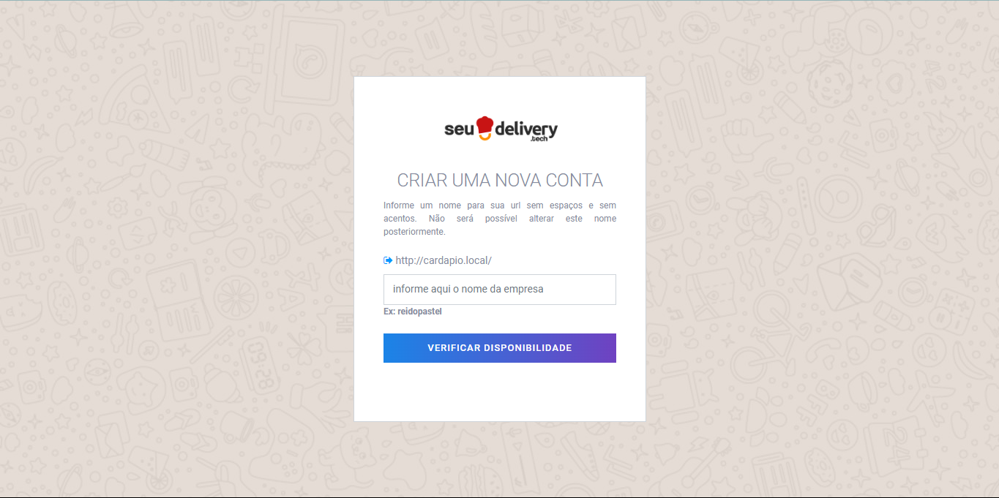
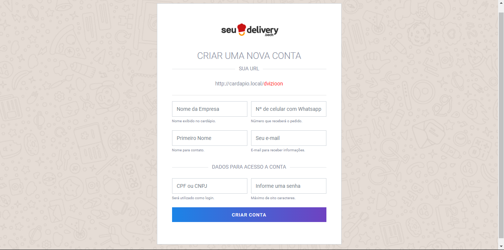
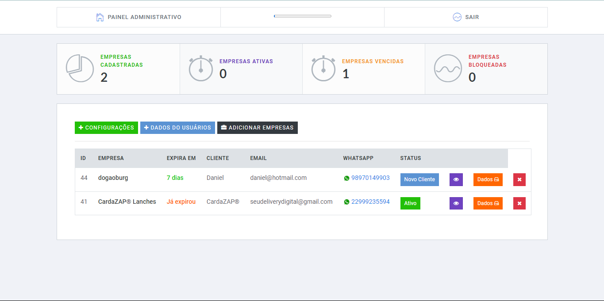

# Cardápio Digital


Este projeto é um sistema de cardápio digital integrado com o WhatsApp, projetado para facilitar o processo de pedidos para clientes e aumentar as vendas dos estabelecimentos. 


## Visão Geral

O cardápio digital permite que os clientes façam pedidos diretamente pelo WhatsApp, fornecendo uma interface amigável e funcional para gerenciamento de produtos e pedidos.

## Funcionalidades

- **Cadastro de Estabelecimento**: Crie e personalize seu cardápio digital.
- **Compartilhamento**: Compartilhe seu QR Code ou link nas redes sociais.
- **Recebimento de Pedidos**: Receba pedidos diretamente no WhatsApp e no painel de vendas.
- **Gerenciamento de Produtos**: Edite preços e produtos em tempo real.
- **Relatórios de Vendas**: Gere relatórios de vendas por datas.
- **Interface Amigável**: Interface fácil e intuitiva para os clientes.

## Tecnologias Utilizadas

- PHP
- HTML
- CSS
- JavaScript
- Font Awesome
- Bootstrap

## Estrutura de Arquivos

- `index.php`: Página principal do cardápio digital.
- `funcoes/Conexao.php`: Script para conexão com o banco de dados.
- `funcoes/Key.php`: Script para manipulação de chaves de acesso.
- `css/meupedido.css`: Arquivo CSS para estilização da página.
- `js/navbar-ontop.js`: Script JavaScript para funcionalidade da navbar.
- `js/animate-in.js`: Script JavaScript para animações.

## Como Usar

1. **Clone o Repositório**

```sh
   git clone https://github.com/seu-usuario/seu-repositorio.git
   cd seu-repositorio
```

## Configuração do Banco de Dados

> [!IMPORTANT]
> `Configure seu banco de dados e insira as informações de conexão no arquivo funcoes/Conexao.php.`

## Inicie o Servidor
> `Inicie seu servidor web e acesse index.php no navegador.`





## Licença
Distribuído sob a licença MIT. Veja LICENSE para mais informações.
